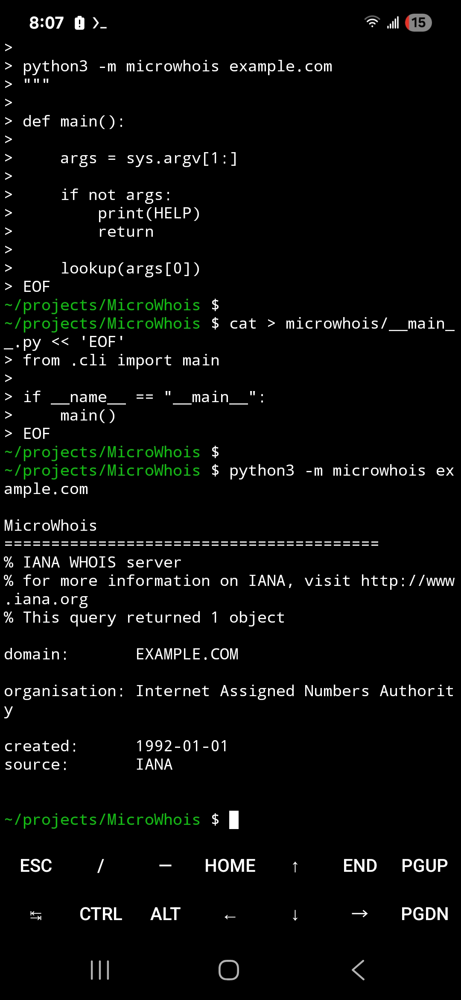

# MicroWhois

Greenfield Micro Suite command-line utility.

## Install

```bash
pip install microwhois
```

## Run

```bash
microwhois
```

## License

MIT

---

## Overview

Lightweight WHOIS lookup utility for exploring domain registration information.

## Features

- Lightweight command-line utility
- Educational focus
- Cross-platform Python
- Fast execution
- Minimal dependencies

## Educational Concepts

- WHOIS
- Domain registration
- Internet governance
- DNS administration

## Part of the Micro Toolkit

This project is one member of the Micro Toolkit, a collection of focused educational networking and cybersecurity utilities. Each project is designed to teach one concept well while remaining simple enough to understand, modify, and extend.

## Roadmap

- Additional educational examples
- Improved documentation
- Expanded functionality while remaining lightweight

## License

MIT License


---

## Screenshot



